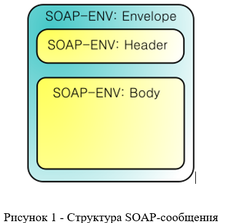
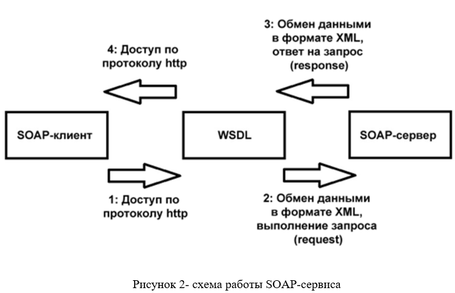

# Веб-сервис с использование протокола SOAP (библиотека spyne)

## Описание технологий SOAP и WSDL
>Soap - протокол обмена структурированными сообщениями в распределённой вычислительной среде

Сообщение SOAP выглядит так:
- Envelope(конверт) — корневой элемент, который определяет сообщение и пространство имен, использованное в документе.
- Header — содержит атрибуты сообщения, например: информация о безопасности или о сетевой маршрутизации.
- Body — содержит сообщение, которым обмениваются приложения.
- Fault — необязательный элемент, который предоставляет информацию об ошибках, которые произошли при обработке сообщений.

 

  

SOAP использует WSDL (Web Services Description Language) — язык описания веб-сервисов и доступа к ним, основанный на языке XML
Структура WSDL:
Каждый документ WSDL 1.1 можно разбить на следующие логические части:
1.	определение типов данных (types) — определение вида отправляемых и получаемых сервисом XML-сообщений
2.	элементы данных (message) — сообщения, используемые web-сервисом
3.	абстрактные операции (portType) — список операций, которые могут быть выполнены с сообщениями
4.	связывание сервисов (binding) — способ, которым сообщение будет доставлено

Приведем схему работы SOAP-сервиса:
 

  

 

## Описание созданного Web сервиса

Методы:
- get_all_article(orderby)-выдает список всех статей хранящийся в БД. Сортирует записи по введенному полю. Если вводится пустая строка или поле которого не существует, тогда выводит весь список записей из БД без сортировки.
- get_article(id,title)-выдает определенную запись по идентификатору или названию.Если запись не существует в БД возвращает сообщение «Запись не найдена». Если пользователь вводит  id и title,поиск осуществляется по id
- addarticle( title, content, author, is_private)-добавляет новую запись в БД. Если поля были заполнены неверно возвращает или запись с таким title уже существует, тогда сообщение «Ошибка добавления записи» 
- delete_article(title)- удаление записи по названию (названия уникальны). Если записи нет (пытаемся удалить несуществующую) возвращает сообщение «Ошибка удаления записи»
- change_article(id_, title_, content_, is_private_) -изменение выбранной по id записи.При попытке изменить несуществующую запись возвращает «Запись не найдена».При отправке пустых полей,данные поля в записи БД не изменяются
- register_user(email, username, password)-регистрация нового автора. Осуществляется проверка ввода email и password,также проверка на уникальность email  в БД.При ошибке ввода email возвращает сообщение «Неверный логин». При ошибке ввода password возвращает «Неверный пароль»
